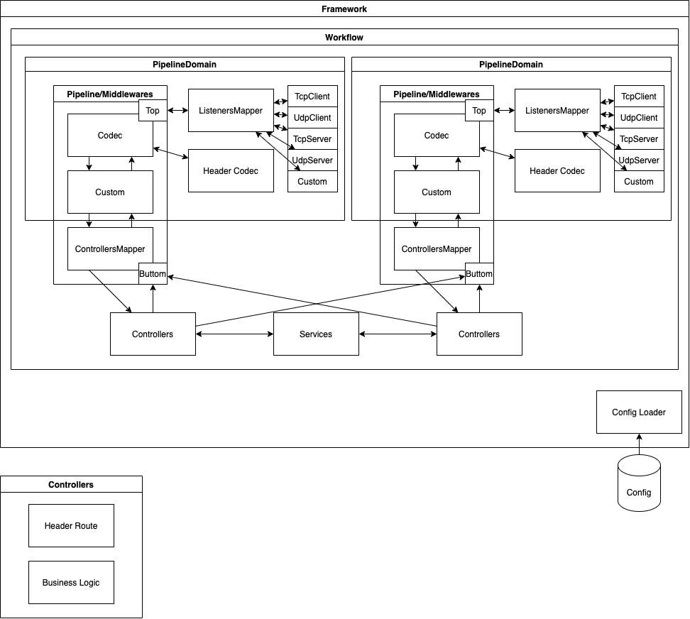
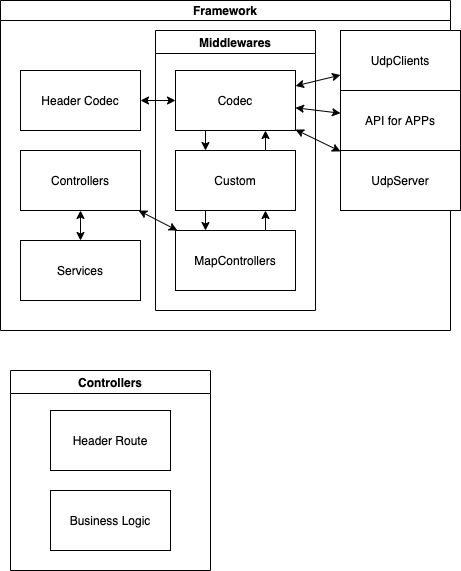

# Socket Back-End Framework

## Architecture

### Relay Model

### Request-Response Model

(deprecated)

## Features

-   Each configurable module has a clear responsibility.
-   Business logic decouples from transport infrastructure and pipelines.
-   It both supports the relay network model or the request-response network model.
-   Controllers can have different pipeline domains sent application messages.
-   It supports custom protocols in nature.

## How to use

The project `SocketBackendFramework.Relay.Sample` gives a simple example of using the framework. A new project can take this sample as a boilerplate.

## Components

-   TransportAgent := a wrapped socket handler.
-   TransportMapper := an object that organizes many transportAgents.
    -   It is only configurable from config.json, not from user code.
-   PacketContext := an object that carries information and flows between a transportMapper and one of its transportAgents.
-   MiddlewareContext := an object that carries information and flows within a pipeline.
    -   Users should implement it.
    -   Usually, a middlewareContext should bring a packetContext.
-   ContextAdaptor := a convertor between packetContexts and midlewareContexts.
    -   It acts as an adaptor between a pipeline and a transportMapper.
        -   TransportMappers only accept packetContexts.
        -   Pipelines only accept middlewareContexts.
-   Pipeline := a stack-like data structure containing several middlewares.
    -   Those middlewares decorate the middlewareContexts that pass through the pipeline.
    -   When the middlewareContexts go to the bottom of the pipeline, they should contain information ready to use by controllers.
    -   When the middlewareContexts go to the top of the pipeline, each should contain a complete packetContext ready to use by transportAgents.
-   PipelineDomain := a virtual area including a pipeline and a dedicated transportMapper.
-   Workflow := a virtual area that owns a complete and independent back-end server.
    -   No data exchange is allowed between workflows.
-   WorkflowPool := a virtual area that collects all the running workflows. 
-   Controller := a object that majorly involves business logic.

## Notices

-   Disposal of socket handlers
    -   When disconnection hits a socket handler, the organizer of many socket handlers should dispose the socket handler.
        -   The organizer can be `Listener` or `TransportMapper`.
            -   `Listener` disposes `TcpSessionHandler`.
            -   `TransportMapper` disposes `TransportClient`.
    -   A timeout only directly activates a disconnection, not a disposal.
    -   When an organizer decides to dispose one of the socket handlers, it should do the disposal before telling controllers about the disconnection.
